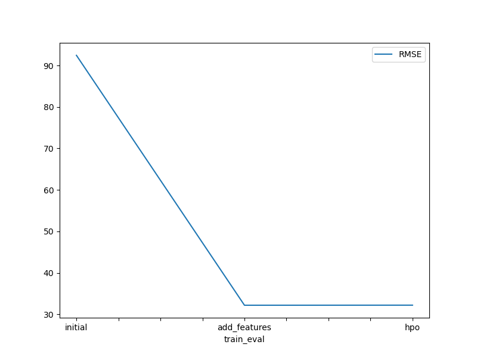
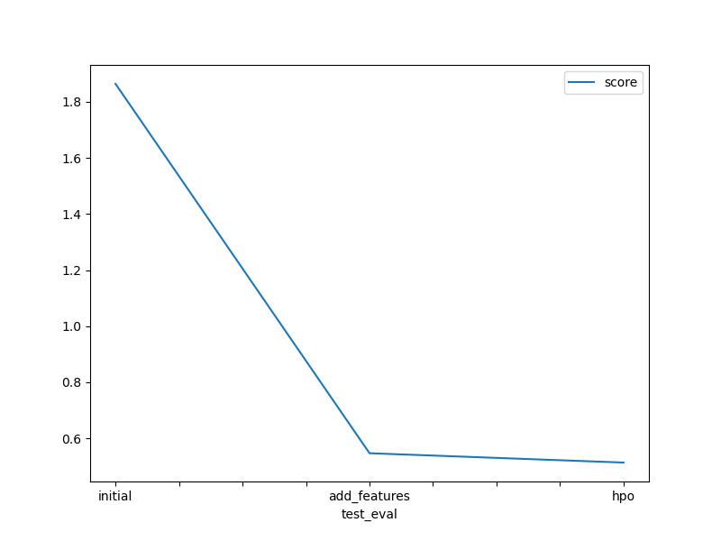

# Report: Predict Bike Sharing Demand with AutoGluon Solution
#### Christian Kalla

## Initial Training
### What did you realize when you tried to submit your predictions? What changes were needed to the output of the predictor to submit your results?
I had to make sure that all outputs are greater or equal to zero, as it makes no sense to predict a negative number of bikes.

### What was the top ranked model that performed?
The model that performed best was a weighted ensemble model using L2 distance.

## Exploratory data analysis and feature creation
### What did the exploratory analysis find and how did you add additional features?
I noticed that the features for season and weather were modelled as integers meaning that the model training could interprete them in a wrong way.
This is why it makes sense to convert them to categorical values. Furthermore separating the date string into separate features for day, hour and month makes sense to "help" the model understand the date better.

### How much better did your model preform after adding additional features and why do you think that is?
There was a hughe uplift (RMSE went from 1.86 to 0.55).

## Hyper parameter tuning
### How much better did your model preform after trying different hyper parameters?
I could improve the RMSE from 0.55 to 0.51 using different sets of hyperparameters.
Here I used the following hyperparameter sets by modifying the keyword arguments of the fit() function of the tabular predictor:
`hpo_1`: time_limit=600, hyperparameters="zeroshot"
`hpo_2`: time_limit=800, presets="high_quality"
I observed that the `hpo_1`setting improved the results on the test set, although the train error was slightly worse than the one from the original model (with added features).
The second hyperparameter set (`hpo_2`) significantly increased the RMSE metric. My assumption is that more sophisticated models are trained on only one CPU, such that training time is not enough for achieving good results.
I guess increasing the number of CPUs or adding an additional GPU will improve the model performance.

### If you were given more time with this dataset, where do you think you would spend more time?
I would add additional features by looking for external data available for the given time frame that adds meaningful insights (such as number of cars rented within this period or other useful information).
Furthermore I would spend more time on hyperparameter tuning using a more powerful machine.

### Create a table with the models you ran, the hyperparameters modified, and the kaggle score.
|model|hpo1|hpo2|score|
|--|--|--|--|
|initial|?|?|1.86412|
|add_features|?|?|0.54667|
|hpo|0.51341|0.66846|0.51341|

### Create a line plot showing the top model score for the three (or more) training runs during the project.

### Create a line plot showing the top kaggle score for the three (or more) prediction submissions during the project.

## Summary
Adding new date-based features helps to decrease the RMSE error metric for predicting the bike share demand to a high extent. Furthermore tweaks such as converting integer variables to categorical ones
and hyperparameter tuning help to decrease the error further. 
